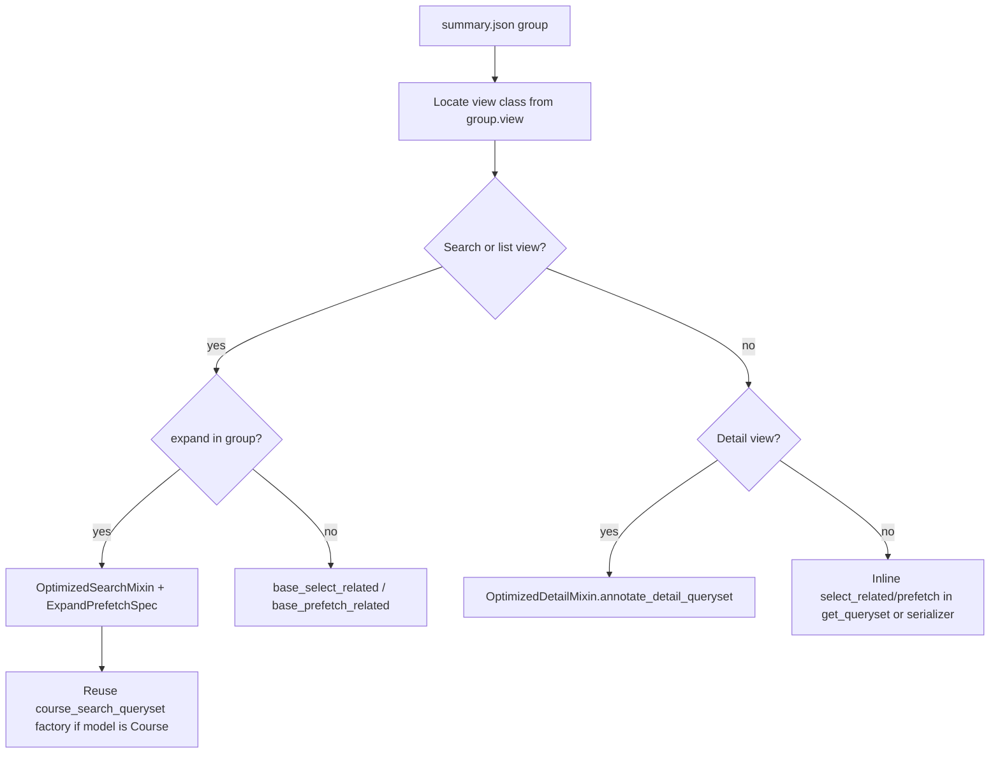

# N+1 agent workflow

Guide for AI agents analyzing nplusone captures and implementing Django queryset fixes.

Related:

- Capture scripts: [`scripts/nplusone/README.md`](../scripts/nplusone/README.md)
- JSON schema: [`scripts/nplusone/schema.json`](../scripts/nplusone/schema.json)
- Existing fixes reference: [`NPLUSONE_PHASE2_BACKLOG.md`](NPLUSONE_PHASE2_BACKLOG.md)
- Cursor rule: [`.cursor/rules/nplusone-log-analysis-and-fixes.mdc`](../.cursor/rules/nplusone-log-analysis-and-fixes.mdc)

## Prerequisites

- `DEBUG=true` and `NPLUSONE_ENABLED=true` in `.env`
- Dev server: `python manage.py runserver`
- Optional session tag: `NPLUSONE_RUN_ID=smoke-001` or header `X-NPlusOne-Run-Id: smoke-001`

## Step 1 — Capture

Exercise endpoints from the frontend, Postman, or tests. Each nplusone warning appends one JSON line to:

`logs/nplusone/YYYY-MM-DD.jsonl`

## Step 2 — Summarize

From `schedjuice-reimagined-be/`:

```bash
./env/bin/python scripts/nplusone/summarize.py logs/nplusone/*.jsonl \
  --output logs/nplusone/reports/summary.json \
  --run-id smoke-001
```

Read `summary.json`. Work groups top-down by `count`, then `max_query_count`.

## Step 3 — Triage

| Field | Use |
|-------|-----|
| `view` | Grep `class {view}` in `app_*/views.py` |
| `path` + `method` | Confirm URL and HTTP verb |
| `model` + `field` | Lazy-load that triggered nplusone |
| `expand` | Client expand param — fixes often expand-specific |
| `query_count` | Severity hint (higher = worse) |
| `count` | How often reproduced in capture |

Skip `count=1` groups unless `max_query_count` is very high.

## Step 4 — Fix decision tree



### Patterns (prefer existing abstractions)

| Situation | Fix |
|-----------|-----|
| Search/list + client expand | [`OptimizedSearchMixin`](../utilitas/queryset_mixins.py) + [`ExpandPrefetchSpec`](../utilitas/queryset_mixins.py) |
| Detail serializer N+1 | [`OptimizedDetailMixin`](../utilitas/queryset_mixins.py) → override `annotate_detail_queryset()` |
| Simple FK on list | `base_select_related = ("user", "course", ...)` |
| Nested course expand | Reuse [`optimized_course_queryset_for_serializer()`](../app_course/course_search_queryset.py) or sibling factories |
| Parent prefetch collision | `replace_lookup` must be the **parent** lookup (e.g. `event`, not `event__course`) |

Do not duplicate prefetch logic when a factory already exists in `app_course/course_search_queryset.py`.

## Step 5 — Implement

1. Open the view from `group.view`
2. Check if `OptimizedSearchMixin` / `OptimizedDetailMixin` is already applied
3. Add or extend `expand_prefetch_specs`, `base_select_related`, or `annotate_detail_queryset`
4. Keep changes scoped to the reported endpoint + expand path

## Step 6 — Verify

1. Re-run capture with the same `NPLUSONE_RUN_ID`
2. Re-run `summarize.py` and confirm the group is gone or `count` dropped
3. Run relevant tests:

```bash
./env/bin/python manage.py test app_course.tests.test_query_perf app_course.tests.test_queryset_mixins utilitas.tests.test_nplusone_logging
```

4. Optional: `SILKY_ENABLED=true` for SQL counts at `/silk/`

## Step 7 — Backlog hygiene

When closing a group, note it in [`NPLUSONE_PHASE2_BACKLOG.md`](NPLUSONE_PHASE2_BACKLOG.md).

## Example agent prompt

```
Read logs/nplusone/reports/summary.json.
Triage the top 5 groups by count.
For each group: locate the view, propose a fix using OptimizedSearchMixin /
ExpandPrefetchSpec or course_search_queryset factories, implement, and verify
with a new capture + summarize.
```
