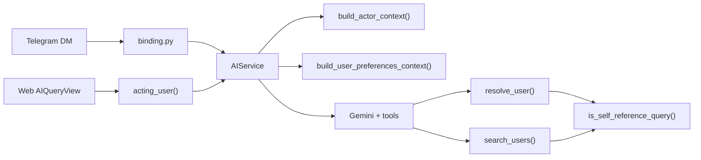

# AI Actor Context — Design Spec

**Date:** 2026-06-27  
**Status:** Implemented (2026-06-27)  
**Repo:** `schedjuice-reimagined-be`

## 1. Summary

When a linked Telegram user asks “what are my classes?”, the bot already knows who
they are at the webhook layer (`telegram_user_id` → `User`), but the Gemini call
does not receive that identity. The model may search for `"me"`, which matches
unrelated names (e.g. “Me Me Win Shwe”) and triggers unnecessary disambiguation.

This spec adds a **shared actor context block** injected into every AI call where
an authenticated user is present, plus a **first-person safety net** in user
resolution tools.

**Primary rollout:** Validate on Telegram DM assistant.  
**Reuse:** Same helper serves web `AIQueryView` with no channel-specific code.

### Locked decisions

| Topic | Choice |
| --- | --- |
| Scope | Telegram first; shared helper usable by web immediately |
| Actor fields | Name, primary email, roles, `user_id` (tools only) |
| First-person handling | Prompt rules + `resolve_user` / `search_users` safety net |
| Tool schema changes | None — no optional/default args on `list_user_courses` |
| Course/department summary | Out of scope |

---

## 2. Problem

### Current flow (Telegram)

```
DM text
  → binding.py: User.objects.filter(telegram_user_id=…).first()
  → run_ai_query.delay(user.id, …)
  → AIService.run(prompt, user, feature="telegram_query", …)
  → Gemini + tools (no actor identity in system prompt)
```

The `user` object is available to every tool as the RBAC actor, but the model
does not see who is asking. For first-person questions it may:

1. Call `search_users` with `query: "me"` → FTS matches names containing “Me”.
2. Call `list_user_courses` with `query: "me"` → same ambiguous path via
   `resolve_user`.
3. Search by the user’s display name when `user_id` was already known.

### Expected flow (after)

```
AIService.run(…)
  → build_actor_context(user, org)   # new
  → build_user_preferences_context(user)
  → Gemini knows: name, email, roles, user_id
  → First-person questions use user_id directly
  → Safety net: is_self_reference_query("me") → actor
```

---

## 3. Architecture



### New: `app_ai/actor_context.py`

```python
def build_actor_context(user: User, *, org: Organization) -> str:
    ...
```

Output format (example):

```
Current user (the person asking):
- Name: Thiha Swan Htet
- Email: thiha@teachersucenter.com
- Roles: coordinator, teacher
- user_id: 42 (use for tool calls when they ask about themselves; never show numeric IDs in replies)
```

Rules:

- Use `user.name`, `user.email` (primary), and `user.roles`.
- Include `user.id` explicitly for tool calls; reinforce “never show in replies”
  (consistent with existing link-formatting rules in `prompts.py`).
- Return empty string if `user` is `None` (defensive; callers should skip).

### New: `app_ai/tools/self_reference.py`

```python
_SELF_EXACT = frozenset({"me", "myself", "i", "my"})

def is_self_reference_query(q: str) -> bool:
    text = (q or "").strip().lower()
    if not text:
        return False
    if text in _SELF_EXACT:
        return True
    # "my classes", "my schedule", "my points"
    if text.startswith("my "):
        return True
    return False
```

**Not** treated as self-reference: `"Me Me Win"`, `"Mecole"`, or other proper
names that happen to contain “me” as a substring — only exact tokens and
`my <rest>` prefix patterns.

### Injection: `AIService.run()`

After `build_user_preferences_context(user)` and before intent classification:

```python
from app_ai.actor_context import build_actor_context

if user is not None and tenant is not None:
    actor_block = build_actor_context(user, org=tenant)
    if actor_block:
        system_context = f"{system_context}\n\n{actor_block}" if system_context else actor_block
```

Applies to `feature="telegram_query"` and `feature="ai_query"` (web) alike.

No changes to `binding.py` or `run_ai_query` beyond what already passes `user`.

### Platform prompt: `app_ai/prompts.py`

Add to `PLATFORM_BASE_TEMPLATE`:

```
Current user context:
- The system prompt includes a "Current user" block when someone is authenticated.
  That person is always who is asking — in Telegram, the linked account holder.
- When they ask about themselves ("my classes", "my schedule", "my points", "how
  many students do I have"), pass their user_id to tools directly. Do not call
  search_users with "me", "my", or their own name to identify them.
- When they ask about someone else, use search_users or query as usual.
```

---

## 4. Tool-layer safety net

### `resolve_user()` (`app_ai/tools/resolve.py`)

At the top of the query branch (when `user_id is None`):

```python
if is_self_reference_query(q):
    return {"status": "ok", "user": actor}
```

No permission check needed — actor is always accessible to themselves.

### `run_search_users()` (`app_ai/tools/search_users.py`)

Before FTS:

```python
if is_self_reference_query(query):
    return [_compact_row(user, org=org)]
```

Returns a single-row list (same shape as a narrow search), avoiding the `"me"`
FTS false-positive path entirely.

### Tools not changed

- `list_user_courses` schema unchanged (`user_id` XOR `query` still required).
- No default-to-actor when both args omitted — validation error remains.
- Other tools that call `resolve_user` inherit the safety net automatically
  (`count_teacher_courses`, `get_staff_point_balances`, etc.).

---

## 5. Data flow example

**User (Telegram):** “what are my classes?”

1. `binding.py` resolves linked `User` id=42.
2. `AIService.run()` system prompt includes actor block with `user_id: 42`.
3. Model calls `list_user_courses({user_id: 42})` → courses returned.
4. Reply: “You are enrolled in KET 152 WE (Coordinator).”

**Fallback if model misbehaves:** calls `list_user_courses({query: "me"})`.

1. `resolve_user(actor=42, query="me")` → `is_self_reference_query("me")` → actor.
2. Same result, no disambiguation.

---

## 6. Error handling

| Case | Behavior |
| --- | --- |
| Unlinked Telegram user | Unchanged — binding rejects before AI |
| Web unauthenticated | Unchanged — 401 before AI |
| `user is None` in `AIService.run()` | No actor block injected |
| Self-reference on inactive actor | Actor already filtered by linked/active checks upstream |
| Admin asks “my classes” | Resolves to admin’s own enrollments (correct) |
| Admin asks “Sarah’s classes” | Unaffected — normal search path |

---

## 7. Testing

### Unit

- `is_self_reference_query`: true for `me`, `myself`, `I`, `my`, `my classes`;
  false for `Me Me Win`, `Mecole`, `memewin`, empty string.
- `build_actor_context`: includes name, email, roles, user_id; omits nothing
  extra; empty when user is None.

### Integration

- `AIService.run()` system context contains actor block when user + tenant present.
- `resolve_user(actor, query="me")` → ok + actor.
- `run_search_users({"query": "me"}, actor)` → single result, actor’s row.
- `run_list_user_courses({"query": "my classes"}, actor)` → actor’s courses
  (via resolve_user safety net).

### Telegram regression

- Extend `app_telegram/tests/test_ai_query.py` or add `app_ai/tests/test_actor_context.py`:
  mock Gemini to assert `list_user_courses` receives `user_id` for “what are my
  classes?” prompt, or end-to-end tool chain without ambiguous candidates.

---

## 8. Files touched

| Area | Files |
| --- | --- |
| Actor context | `app_ai/actor_context.py` (new) |
| Self-reference | `app_ai/tools/self_reference.py` (new) |
| Service | `app_ai/service.py` |
| Prompts | `app_ai/prompts.py` |
| Resolve | `app_ai/tools/resolve.py` |
| Search | `app_ai/tools/search_users.py` |
| Tests | `app_ai/tests/test_actor_context.py`, `app_ai/tests/test_self_reference.py` |

**Not touched:** `app_telegram/binding.py`, tool schemas, frontend.

---

## 9. Out of scope

- Department / job title in actor block
- Precomputed course counts in actor block
- Tool default args (empty `list_user_courses` → actor)
- Group Telegram AI actor resolution
- Persisting actor context in `TelegramAIExchange`

---

## 10. Future

- Web UI smoke-test “my classes” after Telegram validation
- Optional: include `preferred_name` from AI preferences in actor block when set
  (today preferences are a separate block)
