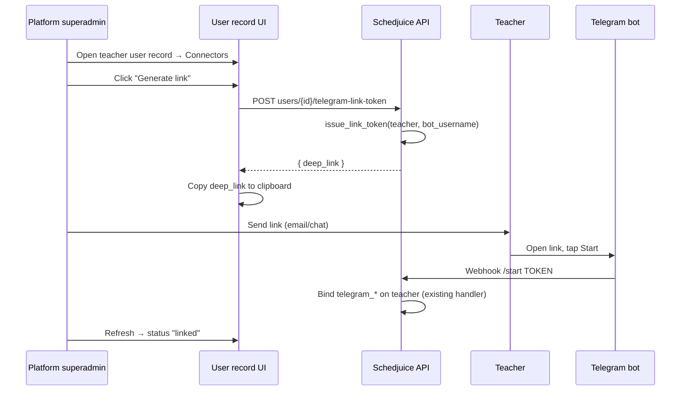

# Telegram Admin Link On Behalf — Design Spec

**Date:** 2026-07-07  
**Status:** Approved design, pending implementation plan  
**Repos:** `schedjuice-reimagined-be`, `schedjuice-reimagined-fe`  
**Approach:** Dedicated user-scoped admin endpoints (Approach A)

## 1. Summary

Platform superadmins need to help teachers link Telegram when self-service fails
(e.g. teacher can't find the Connectors section, link expired, support ticket).
Today linking is **self-service only** via `POST /api/v1/telegram/link-token`; there
is no admin-on-behalf flow (unlike Microsoft's `users/<id>/link-microsoft-account`).

Add platform-internal endpoints and UI so superadmins can:

1. **Generate** a one-time deep link for a target teacher and copy it to clipboard
   (admin sends out-of-band; teacher still taps Start in Telegram).
2. **Force-unlink** a teacher's Telegram binding for support.

Also fix hardcoded `"Schedjuice"` strings in bot replies so unlinked-user messages
use the tenant's organization name (`tenant.name`).

### Scope decisions (locked)

| Decision | Choice |
| --- | --- |
| Who can act | **Platform superadmin only** (`PLATFORM_INTERNAL` permission) |
| Link mechanism | **One-time deep link** — teacher must tap Start (Bot API constraint) |
| Admin UX for link | **Copy to clipboard only** (no auto-open Telegram) |
| Companion action | **Force-unlink** included |
| Self-service | **Unchanged** — teachers still link/unlink on own profile |
| Org admin access | **No** — not `user.update`; superadmin-only |

### Telegram platform constraint (cannot bypass)

The Bot API requires the user to press **Start** in a private chat. Admin-generated
tokens use the same trust model as self-service tokens. Setting `telegram_user_id`
directly (PATCH or admin form) is **explicitly out of scope** — it would skip proof
of possession and leave `telegram_chat_id` unset (DMs would fail).

## 2. Context

- Existing Telegram integration spec:
  `schedjuice-reimagined-be/docs/superpowers/specs/2026-06-19-telegram-integration-design.md`
- Account binding: `app_telegram/binding.py` → `issue_link_token`, `_handle_start_link`
- Self-service API: `POST /api/v1/telegram/link-token`, `POST /api/v1/telegram/unlink`
- Self-service UI: `TelegramConnectorRow` (connect/unlink only when viewer === subject)
- Microsoft precedent: `POST users/<id>/link-microsoft-account` with `user.update`
- Success reply already tenant-aware: `"Linked to {tenant.name}. ..."`

## 3. User flow



**Force-unlink:** Superadmin confirms → `POST users/{id}/unlink-telegram` → four
`telegram_*` fields cleared on target user.

## 4. Bot messaging — tenant-aware

Hardcoded `"Schedjuice"` in `app_telegram/binding.py` bot replies will be replaced
with `tenant.name`, matching the existing success message pattern.

| Trigger | Current | Proposed |
| --- | --- | --- |
| Unlinked user sends free text | "Your Telegram isn't linked to **Schedjuice** yet. Open **Schedjuice** to link it." | "Your Telegram isn't linked to **{tenant.name}** yet. Sign in to link your account." |
| Invalid/expired `/start` token | "This link is invalid or expired. Generate a new one in **Schedjuice**." | "This link is invalid or expired. Generate a new one from your **{tenant.name}** profile." |
| No `ai.telegram_use` permission | "You don't have access to the **Schedjuice** assistant." | "You don't have access to the **{tenant.name}** assistant." |

No new org config field. Update `app_telegram/tests/test_ai_query.py` assertions
to use a tenant with a known `name`.

## 5. Backend API

### New permission (RBAC catalog)

```python
_p(
    "telegram.link_on_behalf",
    "Link Telegram on behalf of users",
    "generate link tokens and unlink Telegram for users on behalf of support",
    "Operational",
    tier=PLATFORM_INTERNAL,
)
```

Superadmin-only; never in tenant permission matrix (same tier as `telegram.configure`).

### New endpoints

| Method | Path | Permission | Behavior |
| --- | --- | --- | --- |
| `POST` | `/api/v1/users/<user_id>/telegram-link-token` | `telegram.link_on_behalf` | Issue link token for **target** user; return `{ "deep_link": "..." }` |
| `POST` | `/api/v1/users/<user_id>/unlink-telegram` | `telegram.link_on_behalf` | Clear target user's four `telegram_*` fields |

Register under `app_auth/urls.py` (mirror Microsoft user-scoped routes).

### Shared logic refactor (minimal)

Extract unlink field-clearing from `TelegramUnlinkView` into a shared helper
(e.g. `clear_user_telegram_binding(user)`) used by both self-service unlink and
admin unlink.

### Validation

| Check | Response |
| --- | --- |
| Caller lacks `telegram.link_on_behalf` | 403 |
| Target user not found | 404 |
| Target is not a teacher | 400 `"Telegram linking is only available for teachers."` |
| Telegram not configured (`!org.telegram_bot_username`) | 400 `"Telegram is not configured for this school."` |
| Link-token: target already linked | 400 `"This user already has Telegram linked."` |
| Unlink: target not linked | 400 `"This user does not have Telegram linked."` |

Link-token reuses `issue_link_token(user, org.telegram_bot_username)` — same
15-minute TTL and token consumption via existing `_handle_start_link`.

### Serializer hardening

Mark on `UserSerializer`:

```python
telegram_user_id = serializers.IntegerField(read_only=True)
telegram_chat_id = serializers.IntegerField(read_only=True)
telegram_username = serializers.CharField(read_only=True)
telegram_linked_at = serializers.DateTimeField(read_only=True)
```

Prevents bypassing the token flow via generic user PATCH.

### Unchanged endpoints

- `POST /api/v1/telegram/link-token` — self only
- `POST /api/v1/telegram/unlink` — self only

## 6. Frontend

### Client API (`src/app/client-api/telegram.ts`)

```typescript
createTelegramLinkTokenForUser(userId: number)
unlinkTelegramAccountForUser(userId: number)
```

### `TelegramConnectorRow` visibility

| Viewer | Subject | UI |
| --- | --- | --- |
| Self (teacher) | Self | Existing connect/disconnect (unchanged) |
| Superadmin | Other teacher | Status chip + **Generate link** + **Force unlink** |
| Non-superadmin | Other user | Read-only status chip (unchanged) |

Gate admin actions with `isSuperAdmin(viewerAccount)`; backend enforces permission.

### Generate link

1. `POST users/{id}/telegram-link-token`
2. `navigator.clipboard.writeText(deep_link)`
3. Toast: `"Link copied — send it to the teacher. They must tap Start in Telegram."`
4. No auto-open, no visible URL field

Disable button while target is already linked.

### Force unlink

Confirmation dialog (destructive) → `POST users/{id}/unlink-telegram` →
`onUpdated()` refresh.

Disable button while target is not linked.

## 7. Error handling

| Scenario | Behavior |
| --- | --- |
| Clipboard API denied | Toast with destructive variant; show message to copy manually from network tab is **not** acceptable — fall back to displaying deep link in toast description (one line, selectable) |
| Token expires before teacher uses it | Teacher sees tenant-aware invalid-token message; admin generates a new link |
| Teacher linked to different Schedjuice user | Existing last-write-wins on bind (unchanged) |
| Admin unlinks while teacher is mid-link | Token still consumable until expiry; new bind succeeds normally |
| Telegram disabled mid-flow | API returns 400; FE shows parsed error |

## 8. Testing

### Backend

| Test file | Cases |
| --- | --- |
| `app_telegram/tests/test_admin_link.py` (new) | Superadmin can issue token for teacher; non-superadmin 403; non-teacher 400; already linked 400; unlink success; unlink not linked 400; self-service endpoints unaffected |
| `app_telegram/tests/test_ai_query.py` | Update expected strings to use tenant name |
| `app_rbac/tests/` | `telegram.link_on_behalf` is `PLATFORM_INTERNAL` |
| `app_auth/tests/` (optional) | `telegram_*` fields not writable via user PATCH |

### Frontend

Manual test plan (no new unit tests required unless existing connector tests exist):

1. Superadmin on teacher record → Generate link → clipboard contains valid `t.me/...?start=...`
2. Teacher opens link → profile shows linked
3. Superadmin force-unlink → status returns to not linked
4. Regular admin on teacher record → no admin buttons
5. Unlinked user DMs bot → message shows org name, not "Schedjuice"

## 9. Non-goals

- Direct link by Telegram username or user ID without Start
- Bulk link generation for many teachers
- Org-admin (non-superadmin) access
- Audit log table for admin link/unlink actions (future enhancement)
- Changing token TTL or binding webhook handler logic

## 10. Files to touch

**Backend**

- `app_rbac/catalog.py` — new permission
- `app_auth/urls.py` — two routes
- `app_auth/views.py` — two RBAC views (or `app_telegram/views.py` if preferred)
- `app_telegram/binding.py` — tenant-aware messages + optional `clear_user_telegram_binding`
- `app_telegram/views.py` — use shared unlink helper
- `app_auth/serializers.py` — read_only telegram fields
- `app_telegram/tests/test_admin_link.py` — new
- `app_telegram/tests/test_ai_query.py` — updated assertions

**Frontend**

- `src/app/client-api/telegram.ts` — two API functions
- `src/components/connectors/telegram-connector-row.tsx` — superadmin actions
