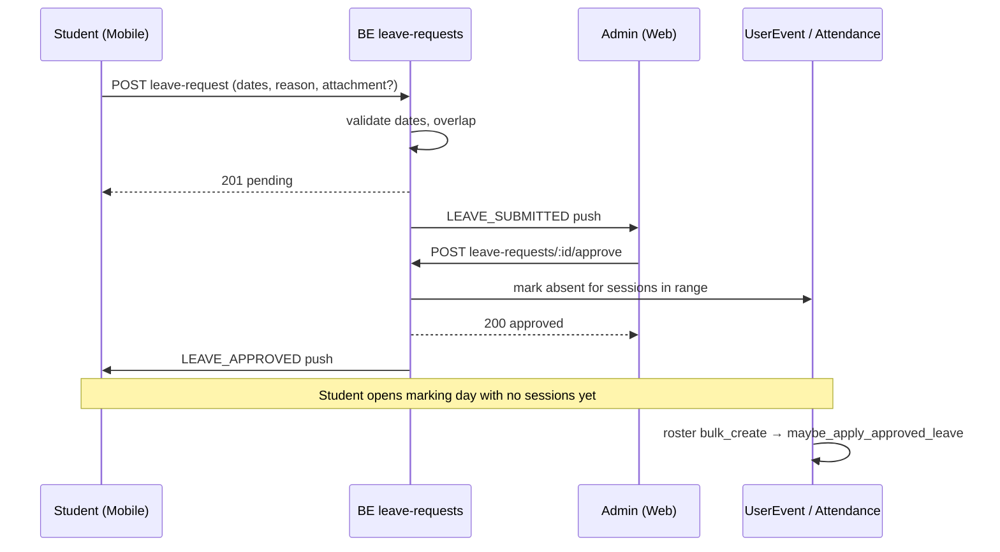

# Student Leave Request — Design Spec

**Date:** 2026-08-21  
**Status:** Approved (2026-08-21)  
**Surface:** BE `app_attendance` (new `LeaveRequest` model); student **mobile**; admin **web (FE)**  
**Related:** [2026-06-28-course-attendance-marking-design.md](./2026-06-28-course-attendance-marking-design.md), [2026-08-20-parent-complaint-center-design.md](./2026-08-20-parent-complaint-center-design.md) (student submit + admin review pattern), `app_course/join_request_approval.py` (approve helper pattern)

## Summary

Students submit **whole-day leave requests** from the mobile app (single date or date range), with a required reason and optional supporting document. School **admins** review pending requests on the web app and **approve** or **deny** them. On **approve**, the system marks the student **absent** on all scheduled class sessions across enrolled courses for each day in the range. Both students and admins receive **push + in-app** notifications at key events.

There is **no org feature flag** — once shipped, leave requests are available to all tenants (access still gated by RBAC).

## Confirmed decisions

| Topic | Decision |
|-------|----------|
| Scope | **Whole-day** leave; default single date; optional **date range** (`start_date`–`end_date`) |
| Per-class selection | **Out of scope v1** — leave applies to all enrolled courses for each day |
| Clients | **Mobile** (student submit/view/edit/cancel) + **Web FE** (admin review) |
| Attendance link | On **approve** → set `UserEvent.attendance_status = absent` for all sessions on those dates; `attendance_note` references the leave request |
| Submit fields | **Dates + required reason** + **optional attachment** (image/document via Juice Box) |
| Reviewers | **School admins only** — `leave.manage_all` (not teachers, not program scope) |
| Notifications | **Both:** student notified on approve/deny; admins notified on new submission |
| Pending actions | Student may **edit** (dates/reason/attachment) or **cancel** while pending |
| Deny | Admin must provide **required denial reason** |
| Date rules | **Today or future** only (`start_date >= today` in tenant timezone); no retroactive requests |
| Overlaps | **Block** new submission if dates overlap an existing **pending or approved** request; return `409` with `existing_request_id` so mobile can deep-link to edit the pending one |
| Tenant gate | **Always on** — no `is_leave_request_enabled` org flag |
| Admin UI on mobile | **Out of scope v1** |

---

## Section 1 — Data model & backend

### New model: `LeaveRequest` (`app_attendance/models.py`)

```python
class LeaveRequest(BaseModel):
    class Status(models.TextChoices):
        PENDING = "pending", "Pending"
        APPROVED = "approved", "Approved"
        DENIED = "denied", "Denied"
        CANCELLED = "cancelled", "Cancelled"

    student = models.ForeignKey(User, on_delete=models.CASCADE, related_name="leave_requests")
    start_date = models.DateField()
    end_date = models.DateField()
    reason = models.TextField()
    status = models.CharField(max_length=16, choices=Status.choices, default=Status.PENDING)
    denial_reason = models.TextField(null=True, blank=True)
    reviewed_by = models.ForeignKey(
        User, null=True, blank=True, on_delete=models.SET_NULL, related_name="reviewed_leave_requests"
    )
    reviewed_at = models.DateTimeField(null=True, blank=True)
    attachment = models.ForeignKey(
        "app_attachment.Attachment", null=True, blank=True, on_delete=models.SET_NULL
    )
```

| Field | Rules |
|-------|-------|
| `start_date` | Required; must be **≥ today** (tenant local date) |
| `end_date` | Required; defaults to `start_date` when omitted on create; must be **≥ start_date** |
| `reason` | Required; non-empty trimmed text |
| `attachment` | Optional; must reference an existing, non-deleted attachment owned by upload flow |
| `denial_reason` | Required when status → `denied`; cleared on re-open paths N/A (no reopen in v1) |
| `reviewed_by` / `reviewed_at` | Set on approve or deny |

**Indexes:** `(student_id, status)`, `(start_date, end_date)` for overlap queries.

### Approve helper (`app_attendance/leave_request_approval.py`)

Canonical side-effect logic (mirrors `approve_course_join_request`):

```python
@transaction.atomic
def approve_leave_request(leave_request: LeaveRequest, *, actor: User, tenant) -> LeaveRequest:
    ...
```

**Steps:**

1. Assert `leave_request.status == pending`.
2. Set `status = approved`, `reviewed_by = actor`, `reviewed_at = now()`.
3. Call `apply_approved_leave_to_attendance(leave_request, tenant)`.
4. Notify student (`LEAVE_APPROVED`).
5. Return updated row.

**`apply_approved_leave_to_attendance`:**

1. Resolve student's enrolled course IDs (`UserCourse`, `assigned_as=student`, active membership — same roster rules as marking).
2. For each calendar day `d` in `[start_date, end_date]` (inclusive):
   - Find `Event` rows for those courses where event local date (tenant timezone) equals `d`.
   - For each event: `get_or_create` `UserEvent(user=student, event=event)`.
   - Set `attendance_status = absent`.
   - Set `attendance_note = "Approved leave #<leave_request.id>"` (append if note already present and not duplicate — prefer replace when note empty or prior leave note from same request).
3. **Do not** downgrade `present` / `late` rows that teachers already marked — if `attendance_status` is already `present` or `late`, **skip** (log at debug). Only set absent when status is `unregistered` or already `absent`. *(Product intent: approved leave covers expected absence; don't overwrite confirmed attendance.)*

**Future sessions:** When `UserEvent` rows are created lazily (e.g. `build_marking_roster` bulk_create), call `maybe_apply_approved_leave_for_user_event(user_event, tenant)` — if the event's local date falls within any **approved** leave range for that student, set absent + note using the same skip rules.

**Deny helper:**

```python
def deny_leave_request(leave_request, *, actor, denial_reason: str, tenant) -> LeaveRequest:
```

- Assert pending; require non-empty `denial_reason`.
- Set status, reviewer fields; **no attendance changes**.
- Notify student (`LEAVE_DENIED`).

**Cancel (student):**

- PATCH or dedicated `POST leave-requests/:id/cancel` — only when `status == pending`.
- Set `status = cancelled`; no attendance changes.

### Overlap validation

On create and on student PATCH (date fields):

```python
def find_overlapping_leave_request(student, start_date, end_date, *, exclude_id=None):
    # Overlap if ranges intersect AND status in (pending, approved)
```

Return **409 Conflict** with body:

```json
{
  "code": "leave_overlap",
  "message": "You already have a leave request for these dates.",
  "existing_request_id": 123,
  "existing_request_status": "pending"
}
```

Mobile uses `existing_request_id` to offer **Edit existing request** navigation.

### API endpoints (`app_attendance/urls.py`)

Mounted under `api/v1/leave-requests` (register in `schedjuice_backend/urls.py`).

| Method | Path | Actor | Permission |
|--------|------|-------|------------|
| `POST` | `/leave-requests` | Student | `leave.create` |
| `GET` | `/leave-requests` | Student | `leave.view_own` — own rows only |
| `GET` | `/leave-requests` | Admin | `leave.view_all` — all rows; filters: `?status=`, `?student_id=`, `?start_date_gte=`, `?end_date_lte=` |
| `GET` | `/leave-requests/:id` | Student | `leave.view_own` — own only |
| `GET` | `/leave-requests/:id` | Admin | `leave.view_all` |
| `PATCH` | `/leave-requests/:id` | Student | `leave.update_own` — pending only; fields: `start_date`, `end_date`, `reason`, `attachment_id` |
| `POST` | `/leave-requests/:id/cancel` | Student | `leave.update_own` — pending only |
| `POST` | `/leave-requests/:id/approve` | Admin | `leave.manage_all` |
| `POST` | `/leave-requests/:id/deny` | Admin | `leave.manage_all` — body `{ "denial_reason": "..." }` |

**Serializers:**

- `LeaveRequestSerializer` — admin list/detail (includes student expand, reviewer, attachment URL).
- `StudentLeaveRequestSerializer` — student create/update (no reviewer fields writable).
- Search/list uses existing generic search view pattern if applicable, or dedicated list view with django-filter fields.

**Attachment validation:** Reuse chat/complaint attachment rules — attachment must exist, not deleted, allowed MIME/size (15 MB cap). Single attachment in v1.

---

## Section 2 — Student UX (mobile)

> **Design authority:** Follow [`schedjuice-reimagined-mobile/docs/design-tokens.md`](../../../schedjuice-reimagined-mobile/docs/design-tokens.md) **strictly** for colors, spacing, radii, typography, and component sizing. Read it before any UI work; do not invent one-off values.

Replace the Profile **"Coming Soon"** stub with a full leave-request flow.

### Nav entry

| Location | Visibility |
|----------|------------|
| Profile tab menu row **Leave Request** | Student role + `leave.create` / `leave.view_own` |
| Optional: sidebar quick link | Same gates (mirror complaints pattern if product wants parity) |

Route stack: `app/(protected)/leave-requests/` (outside tabs, like complaints).

### Screens

**1. Leave list** (`/leave-requests`)

- Sections: **Pending**, **Approved**, **Past** (denied + cancelled)
- Row: date range label (`Mar 5` or `Mar 5 – Mar 8`), status badge, submitted relative time
- FAB / header: **New request**

**2. New leave** (`/leave-requests/new`)

- **Start date** picker (default today)
- **End date** toggle or picker — when off/unset, single-day (`end_date = start_date`)
- **Reason** — required multiline text
- **Attachment** — optional; reuse complaint/chat attachment strip + Juice Box upload
- Submit → `POST leave-requests`
- On **409 overlap** → alert with **Edit existing request** → navigate to `/leave-requests/[existing_request_id]`

**3. Detail / edit** (`/leave-requests/[id]`)

- Read-only when not pending (show status, denial reason if denied, reviewer name + date if decided)
- **Pending:** editable dates/reason/attachment; **Save** → PATCH; **Cancel request** → confirm → POST cancel
- Approved: show date range + "Approved" badge (informational)

**4. Notifications**

- Push on approve/deny → deep link to `/leave-requests/[id]`
- Handler: `lib/notifications/leave-request-notification.ts` (mirror `complaint-notification.ts`)

### RBAC & guards

Add to `MOBILE_ROUTE_PERMISSIONS`:

```typescript
{ prefix: '/leave-requests/new', anyOf: ['leave.create'] },
{ prefix: '/leave-requests', anyOf: ['leave.view_own'] },
```

`PermissionGate` on layout; student-only access helper if needed (no org flag check).

### i18n

New keys under `leaveRequest.*` in `en.ts`; copy same English into `my.ts` per project i18n rule.

---

## Section 3 — Admin UX (web FE)

> **Design authority:** Follow [`schedjuice-reimagined-fe/DESIGN.md`](../../../schedjuice-reimagined-fe/DESIGN.md) **strictly** for layout, tokens, motion, voice, and component patterns. Read it before any UI work; no shadcn, no generic dashboard aesthetics.

New admin area under **Academics** or **Services** (prefer **Academics** near attendance).

### Route

`/leave-requests` — list + detail panel or dedicated detail route `/leave-requests/[id]`.

**Nav:** `nav-routes.tsx` entry gated by `leave.view_all`.

**Middleware:** `route-permissions.ts` prefix `/leave-requests` → `anyOf: ['leave.view_all']`.

### List view

- Default filter: **Pending** tab (badge count)
- Columns: student name, date range, reason (truncated), submitted at, status
- Filters: status, date range, student search (reuse user combobox)
- Row click → detail

### Detail / review

- Student chip (link to user record)
- Full reason text
- Attachment preview/download (reuse `ChatAttachmentRenderer` or document preview component)
- Date range display
- Actions (pending only):
  - **Approve** — confirm dialog → `POST .../approve` → toast success
  - **Deny** — modal with **required** denial reason textarea → `POST .../deny`
- Show reviewer + timestamp + denial reason when decided

**No admin mobile UI in v1.**

### SDK / data layer

- `src/sdk/resources/leave-requests.ts` + `src/sdk/hooks/leave-requests.ts`
- TanStack Query: list query keyed by filters; mutations invalidate list + detail
- No raw axios in components (per FE N+1 rule)

---

## Section 4 — Notifications

### New utility notification kinds

Add to `UtilityNotificationKind`:

| Kind | Audience | Trigger |
|------|----------|---------|
| `LEAVE_SUBMITTED` | Users with `leave.manage_all` | Student creates leave request |
| `LEAVE_APPROVED` | Submitting student | Admin approves |
| `LEAVE_DENIED` | Submitting student | Admin denies |

### Delivery

- **In-app:** catalog row with deep links:
  - Admin → `/leave-requests?highlight=<id>` or detail route
  - Student → mobile `/leave-requests/<id>` (push data `href` for mobile router)
- **Push:** immediate via `enqueue_push_for_user_ids` (same pattern as `app_crm/complaint_notifications.py`)

### Admin recipient resolution

Query users with **`leave.manage_all`** permission (RBAC), not broad role heuristics — respects custom role assignments.

Implementation: `app_attendance/leave_request_notifications.py`.

---

## Section 5 — Permissions (RBAC)

### New permissions (`app_rbac/catalog.py`)

| Code | Description | Default grant |
|------|-------------|---------------|
| `leave.create` | Submit a leave request | `student` |
| `leave.view_own` | List/view own requests | `student` |
| `leave.update_own` | Edit/cancel own pending requests | `student` |
| `leave.view_all` | List/view all students' requests | `admin`, `manager` (and roles that already get attendance admin bundles) |
| `leave.manage_all` | Approve/deny leave requests | `admin`, `manager` |

Migration seeds permissions and role grants. **Teachers do not** receive `leave.manage_all` or `leave.view_all` by default.

### View queryset

- Student endpoints: filter `student=request.user`.
- Admin endpoints: all rows; object-level check on detail/actions.

---

## Section 6 — Error handling, edge cases, testing

### Error handling

| Case | Response |
|------|----------|
| Non-student creates leave | 403 |
| Student views another student's request | 404 |
| Edit/cancel non-pending | 403 |
| Approve/deny non-pending | 409 |
| Deny without `denial_reason` | 400 validation |
| `start_date` in past (tenant TZ) | 400 |
| `end_date < start_date` | 400 |
| Overlapping pending/approved range | 409 + `existing_request_id` |
| Invalid/missing attachment | 400 |
| Admin without `leave.manage_all` | 403 |

### Edge cases

| Case | Behavior |
|------|----------|
| Approve but no sessions on a day | No-op for that day; leave still approved |
| Student not enrolled in any course | Approve succeeds; no UserEvents to update |
| Session already marked present/late | **Skip** — do not overwrite (see Section 1) |
| Student cancels pending | Status `cancelled`; admin list removes from pending filter |
| Multiple admins | First approve wins; second gets 409 |
| Approved leave spans 30+ days | Allowed; batch update UserEvents in helper (chunk if needed) |
| Attachment deleted after submit | Detail shows broken state; edit pending to replace — optional validation on PATCH |
| Deactivated student | Cannot create new; existing rows remain visible to admin |

### High-value tests (BE)

- Student create with single day and range; `end_date` defaults
- Overlap 409 includes `existing_request_id` for pending and approved
- Approve marks `unregistered` UserEvents absent with note; skips `present`/`late`
- Approve notifies student; create notifies `leave.manage_all` holders
- Deny requires reason; no attendance change
- Student PATCH blocked when not pending
- Student cannot list all requests
- Admin approve/deny requires `leave.manage_all`
- `maybe_apply_approved_leave_for_user_event` on roster bulk_create
- Date validation rejects yesterday in tenant TZ

### High-value tests (mobile)

- Overlap error navigates to edit existing pending request
- Pending detail allows save + cancel; approved detail read-only
- Profile menu opens leave stack (not coming soon alert)

### High-value tests (FE)

- Nav hidden without `leave.view_all`
- Deny button disabled until reason entered
- Approve/deny mutations refresh pending count

---

## Out of scope (v1)

- Per-class or per-session leave selection
- Teacher approval or program/category scoped reviewers
- Org toggle / feature flag
- Admin review on mobile
- Reopen denied request or admin revoke approval
- Threaded comments on leave requests
- Email notifications (push + in-app only)
- Auto-create new **excused** attendance status (use existing **absent**)
- Integration with campus check-in or god-view badges (future enhancement)
- Bulk approve/deny
- Parent/guardian submit on behalf of student

---

## Agentic implementation

> **For agentic workers:** When implementing this feature via subagents (Task tool or superpowers:subagent-driven-development), use model **`composer-2.5`** for all subagents unless the user specifies another. Dispatch one fresh subagent per layer/task (BE model → helpers → views → RBAC → mobile → FE) and review between tasks.

**Design docs (mandatory before UI subagents):**

| Client | Read first | Rule |
|--------|------------|------|
| **Web (FE)** | [`schedjuice-reimagined-fe/DESIGN.md`](../../../schedjuice-reimagined-fe/DESIGN.md) | Follow **strictly** — principles, tokens, motion, voice, bilingual type, banned patterns (§14) |
| **Mobile** | [`schedjuice-reimagined-mobile/docs/design-tokens.md`](../../../schedjuice-reimagined-mobile/docs/design-tokens.md) | Follow **strictly** — colors, spacing, radii, sizing; pair with `global.css` variables |

Subagents working on mobile or FE UI must read the relevant doc in full before writing components. Backend-only subagents may skip.

---

## Implementation touchpoints (reference)

| Layer | Files / areas |
|-------|----------------|
| BE model | `app_attendance/models.py` — `LeaveRequest`; migration |
| BE helpers | `app_attendance/leave_request_approval.py`, `leave_request_validation.py`, `leave_request_notifications.py` |
| BE views | `app_attendance/views.py` or `leave_request_views.py`; `urls.py` |
| BE attendance hook | `app_attendance/marking_services.py` — call `maybe_apply_approved_leave_for_user_event` after roster bulk_create |
| BE RBAC | `app_rbac/catalog.py`, `defaults.py`, migration seed |
| BE notify | `app_utility_notifications/utility_notification_kinds.py` |
| FE admin | `src/app/(internal)/leave-requests/` pages; list + detail components |
| FE SDK | `src/sdk/resources/leave-requests.ts`, `src/sdk/hooks/leave-requests.ts` |
| FE nav/RBAC | `src/config/nav-routes.tsx`, `src/config/route-permissions.ts` |
| Mobile | Replace profile stub; `app/(protected)/leave-requests/*`; `lib/api/leave-requests.ts`, `lib/hooks/use-leave-requests.ts`, `lib/notifications/leave-request-notification.ts` |
| Mobile RBAC | `lib/rbac/require-permissions.ts` |
| Mobile i18n | `lib/i18n/locales/en.ts`, `my.ts` |

---

## Architecture diagram



---

## Open questions (resolved)

All product questions resolved in brainstorming session 2026-08-21. No TBDs remain for v1 planning.
